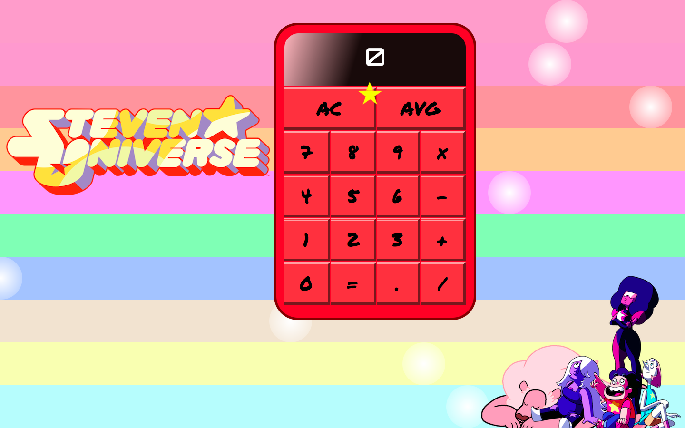
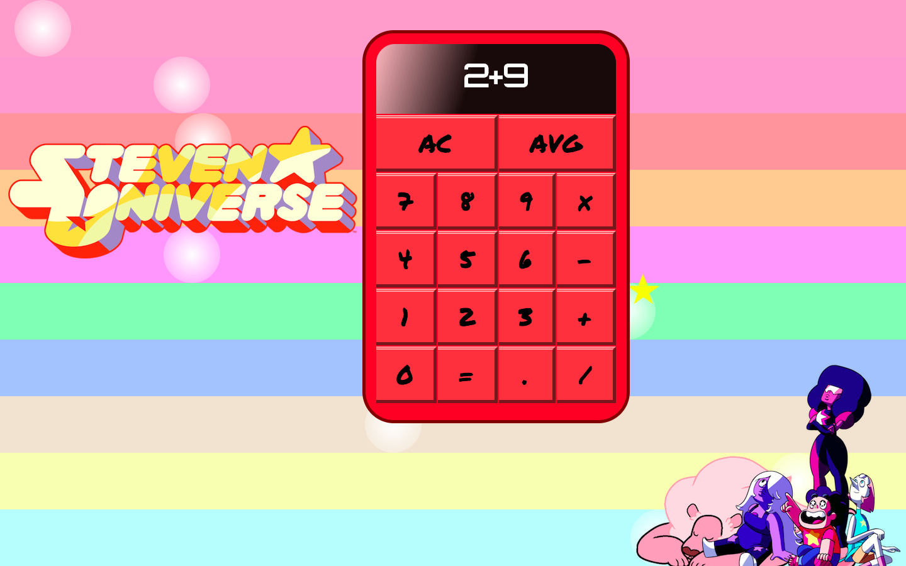

# Steven Universe Calculator
## By Andrea McKenzie
  Email:[mckenzie.andrea.m@gmail.com](mailto:mckenzie.andrea.m@gmail.com)
  LinkedIn:[Andrea McKenzie](https://www.linkedin.com/in/andrea-mckenzie)
  Skype: andrea-michelle-mckenzie

---
**STEVEN UNIVERSE** and all related characters and elements are trademarks of and © Cartoon Network

---

This is a functioning basic algebraic calculator that also contains an additional `avg` button. This calculator was written with: 

- HTML
- CSS3
- ES6 Javascript

## Screenshots

## CSS'splination:
#### calc.css
- The bars in the background are all `div.background-stripes` with each color being supplied independently though the `background-color` property. All ten are stretched to `100vw` and lft stacked.

- The `div.overlay` are `10vh by 10vh` with a `border-radius` of `300px` and a `radial-gradient` background. Each one is assigned the animation `dots`, which translates them across the screen at different speeds and with different `animation-delay` values.

#### star.css
-  `div#star-glow` is a container for the star spinning around the calculator. It centers the star and gives it `position:absolute` so it can travel anywhere across the page. It was given an animation of `move` that translates it across the page and also changes the `z-index` based on position to give the illusion of depth. 
- The star itself is three transparent-border divs layered on top of one another to get that shape.  

